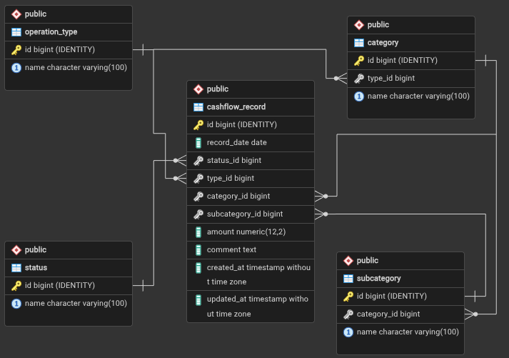
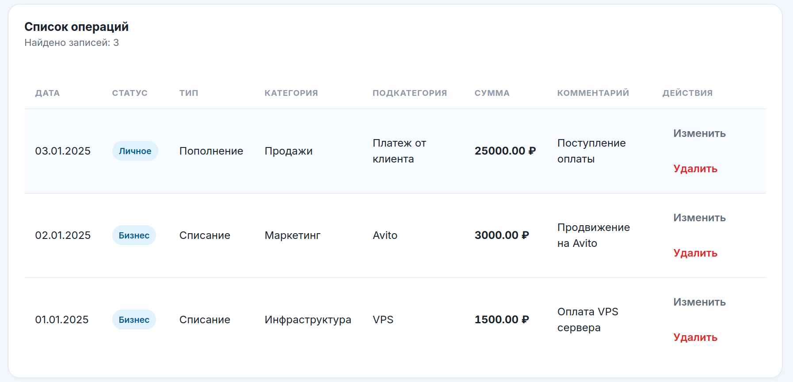
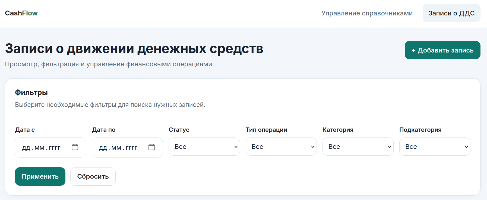
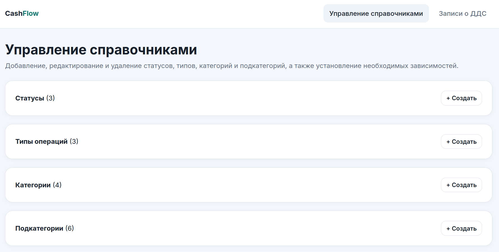
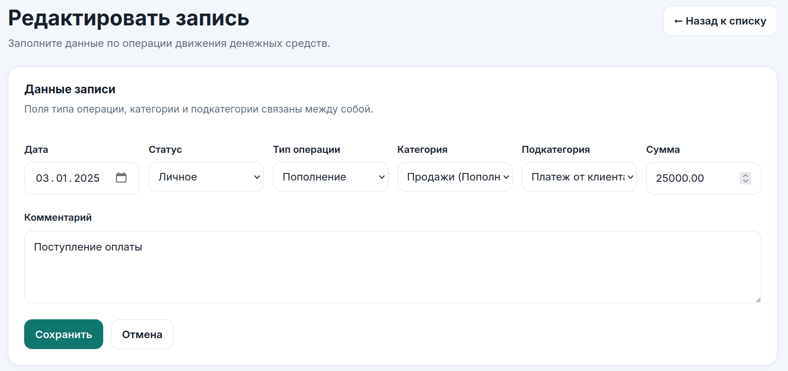
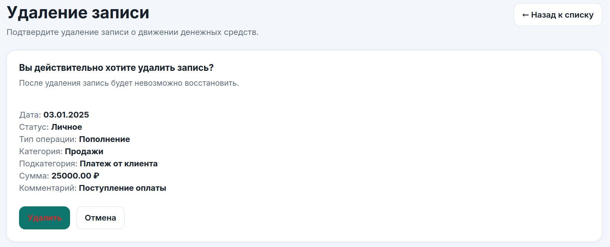

# Веб‑сервис для управления движением денежных средств (ДДС)

Веб-приложение на Django для учета, анализа и управления ДДС с поддержкой справочников и логических зависимостей между типами операций,
категориями и подкатегориями.

---

## Функциональность

### Записи ДДС

- Создание записи о движении денежных средств.
- Просмотр списка всех записей в таблице.
- Фильтрация записей по:
  - периоду дат,
  - статусу,
  - типу операции,
  - категории,
  - подкатегории.
- Редактирование и удаление записей.

### Справочники

- Статусы (например, «Бизнес», «Личное», «Налог»).
- Типы операций (например, «Пополнение», «Списание»).
- Категории (например, «Инфраструктура», «Маркетинг»).
- Подкатегории (например, «VPS», «Proxy», «Avito», «Farpost»).

### Логические зависимости

- Категория всегда привязана к конкретному типу операции.
- Подкатегория всегда привязана к конкретной категории.
- Пользователь не может:
  - выбрать категорию, не относящуюся к выбранному типу операции;
  - выбрать подкатегорию, не относящуюся к выбранной категории.

Проверка этих правил реализована:
- на уровне форм (каскадный выбор + фильтрация),
- на уровне модели `CashflowRecord` (валидация в методе `clean()`).

### Валидация полей

Обязательные поля записи ДДС:

- тип операции;
- категория;
- подкатегория;
- сумма.

Комментарий и статус являются необязательными.

---

## Технологический стек

- Python 3.12
- Django 6.0.4
- SQLite
- HTML, CSS
- JavaScript (реализация AJAX для зависимых выпадающих списков)
- pytest, pytest-django (тесты)
- ruff (линтинг и статический анализ)

---

## ER‑диаграмма

В проекте используется простая модель данных для учета ДДС со справочниками:

- `Status`
- `OperationType`
- `Category`
- `Subcategory`
- `CashflowRecord`



---

## Установка и запуск

### 1. Клонирование репозитория

```bash
git clone https://github.com/doshamine/cash-flow.git
cd cash-flow
```

### 2. Настройка виртуального окружения

#### Windows

```bash
python -m venv venv
venv\Scripts\activate
```

#### Linux / macOS

```bash
python3 -m venv venv
source venv/bin/activate
```

### 3. Установка зависимостей

```bash
pip install -r requirements.txt
```

### 4. Конфигурация окружения

В корне проекта создайте файл `.env`:

```env
SECRET_KEY=django-insecure-test-key
DEBUG=True
```

Значения `SECRET_KEY` и `DEBUG` должны быть переопределены для продакшн‑окружения.
Для локальной разработки эти значения подходят.

### 5. Миграции базы данных

```bash
python manage.py makemigrations
python manage.py migrate
```

После выполнения миграций в корне проекта будет создан файл базы данных `db.sqlite3`.

### 6. Загрузка демонстрационных данных

В проекте подготовлены фикстуры для быстрого наполнения базы справочниками
и примерами записей (см. директорию `fixtures/`).

Пример команды:

```bash
python manage.py loaddata statuses operation_types categories subcategories cashflow_records
```

### 7. Создание суперпользователя (опционально)

Для доступа в административную панель Django:

```bash
python manage.py createsuperuser
```

### 8. Запуск сервера

```bash
python manage.py runserver
```

Приложение будет доступно по адресам:

- главная страница: http://127.0.0.1:8000/
- админ‑панель: http://127.0.0.1:8000/admin/

---

## Структура проекта

- `cash_flow/` — конфигурация Django‑проекта:
  - `settings.py` — настройки проекта (подключение приложения `ledger`, SQLite)
  - `urls.py` — корневые маршруты (`admin/`, подключение `ledger.urls`)
- `ledger/` — приложение для учета ДДС:
  - `models.py` — модели `Status`, `OperationType`, `Category`, `Subcategory`, `CashflowRecord`
  - `forms.py` — формы для ДДС и справочников
  - `views.py` — представления (CRUD для ДДС и справочников)
  - `urls.py` — маршруты приложения
  - `templates/` — HTML‑шаблоны интерфейса
  - `fixtures/` — JSON‑фикстуры
  - `tests/` — тесты для моделей, форм и представлений
  - `static/` — статические файлы (CSS, JavaScript)
  - `migrations/` — миграции базы данных
- `screenshots/` — скриншоты интерфейса
- `requirements.txt` — список зависимостей

---

## Скриншоты

Скриншоты демонстрируют основные веб-страницы приложения.

### Список записей ДДС



### Фильтры



### Управление справочниками



### Редактирование записи



### Удаление записи



---

## Тесты и качество кода

Проект настроен для тестирования с использованием `pytest`.

### Запуск тестов

```bash
pytest
```

### Линтинг

```bash
ruff check .
```
